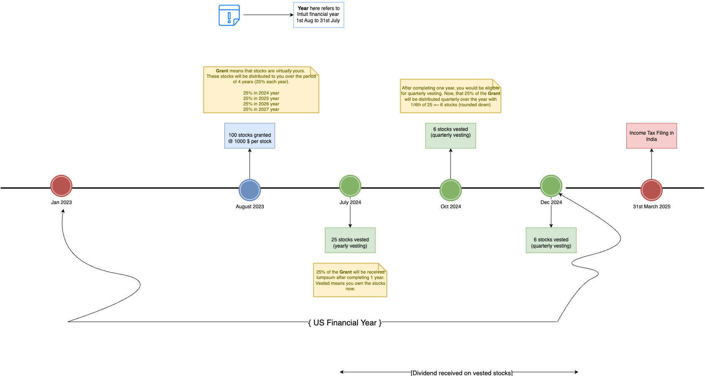
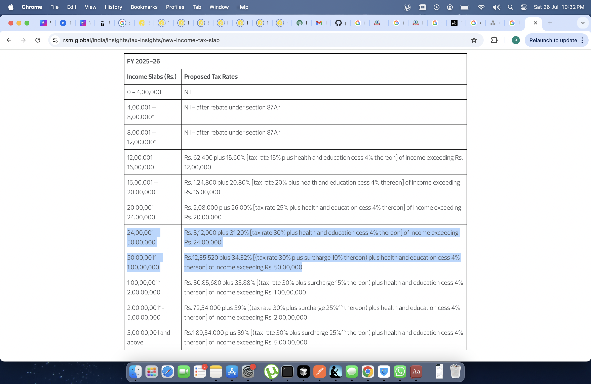

# How Does Taxation Work

## Important Note
If you're filing tax on March 31st, 2025, you have to consider the previous financial year of the US (here, the period will be 1st Jan 2024 to 31st Dec 2024). That is, you don't have to consider this period: 1st Jan 2025 - March 31st 2025. That is how you consider your US income.

There are 4 types of incomes and 4 types of taxes in this cycle. There are things which we have to voluntarily declare.

## 1. Taxation on Vested Stocks

### State as of July 2024
- **Total income** = income from salary + $1000 (stock price at the time of grant) × 25 (number of stocks vested)
- This total income is taxed at your tax slab rate at that point of time (say, 31.2% as per projected income)
- More on tax slab rates: [New Income Tax Slab](https://www.rsm.global/india/insights/tax-insights/new-income-tax-slab)

> **Note:** Projected income does not include future vestings. For example, on July 2024 you're taxed at 31.2% as per your projected income. But after October 2024's vesting, your projected income becomes more than 50L+, tax slab will change, then you will be eligible for 10% surcharge, it will be deducted from your December-March's pay.

### From where is that 31.2% tax deducted?
By means of withholding the shares by your company. Let's say you received 25 stocks worth $25,000 and you're in 31.2% tax slab rate. Then 31.2% will be deducted at source from your stocks itself as a means of deducting tax. Your stocks will be rounded down.

**Example:**
- Tax calculated on stocks = 31.2% of 25 = 7.8
- Number of stocks you should receive after tax = 25 - 7.8 = 17.2
- Number of stocks received actually = 17 (rounded down)
- Remaining = 0.2

This remaining 0.2 is added to the taxes.

This is all according to Indian Income and Indian taxation, so all this comes as part of Form 16. You don't need to do anything for this.

## 2. Taxation on Dividends

Once you have vested stocks, you can receive dividends on those stocks you own. This dividend is added to your trade account (Fidelity / E*TRADE). This dividend is classified as **Foreign income**. This foreign income is taxed in the US at 25%.

**Example:**
- Dividend amount = $10
- US Tax Rate = 25%
- Tax amount = 25% of $10 = $2.5

The Indian government doesn't know about it unless you declare it. Declaration of this foreign income requires filing of 5 forms as part of ITR. A lot of people don't show this income, but it is there as part of the **1042-S form**.

## 3. Taxation on Dividends on Granted but Not Vested Stocks

This is taxation on dividends generated between Grant and Vest cycle. For example, between August 2023 and July 2024.

In this period, stocks are virtually yours. They will be truly yours once you complete 4 years of tenure with 25% of grant vested to you each year.

In your quarterly tax computation sheet, you will see a dividend component. That dividend component is actually this dividend.

This comes as part of your salary, it will be reflected in your vesting month's payslip under dividend component. For this, there is no US tax. It comes directly with your salary, doesn't go to your E*TRADE/stock account.

**No choice to show or not to show this income. It's automatic.**

This comes as part of regular income and is taxed as regular income.

During this period, dividends are being accumulated, and they become yours when stocks vest and become yours.

## 4. Taxation on Sold Stocks

Let's say we had 25 vested stocks in July 2024, we sold these stocks in October 2024.

**Example:**
- Total stocks granted on Aug 2023 = 100
- Grant price = $1000
- Total stocks vested on July 2024 = 25

Let's say we sell them in Oct 2024 at $1200 per stock price.
- Profit on each sold stock = $1200 - $1000 = $200

This is considered as **Capital Gain**.

### There are 2 types of Capital Gains when it comes to foreign assets:

1. **Short Term (STCG):**
   - Definition: Holding foreign asset < 24 months (after vesting)
   - Taxed at your tax slab

2. **Long Term (LTCG):**
   - Definition: Holding foreign asset > 24 months (after vesting)
   - Latest change of rule: If sold after July 2024, it is taxed at 1.5%

This is currently not known to the government and needs to be voluntarily declared, then it will be added to your income. It can raise your slab also.

**You own that foreign asset → You sold that foreign asset → You're liable to pay tax for that foreign asset in India (not US)**

If you don't declare this, currently no action is being taken, but can be taken in the future by the Indian Government. 

