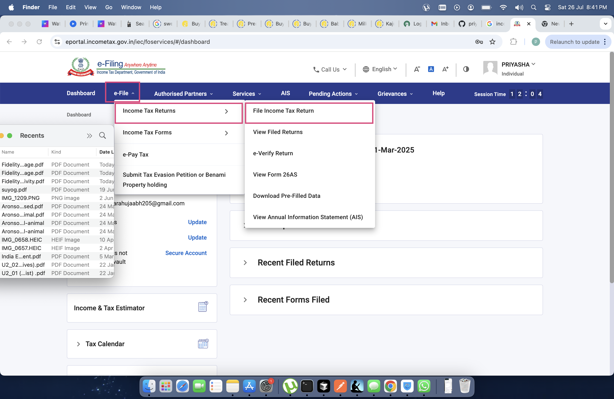
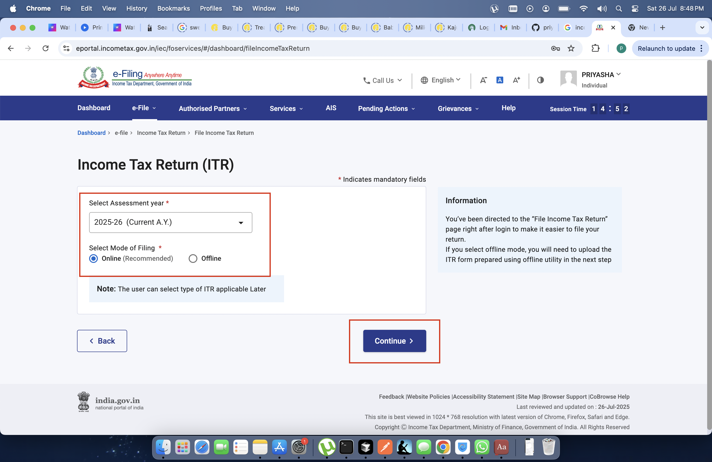
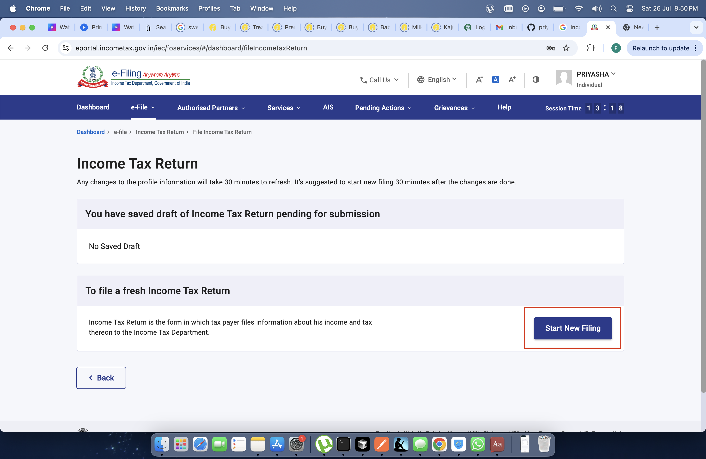
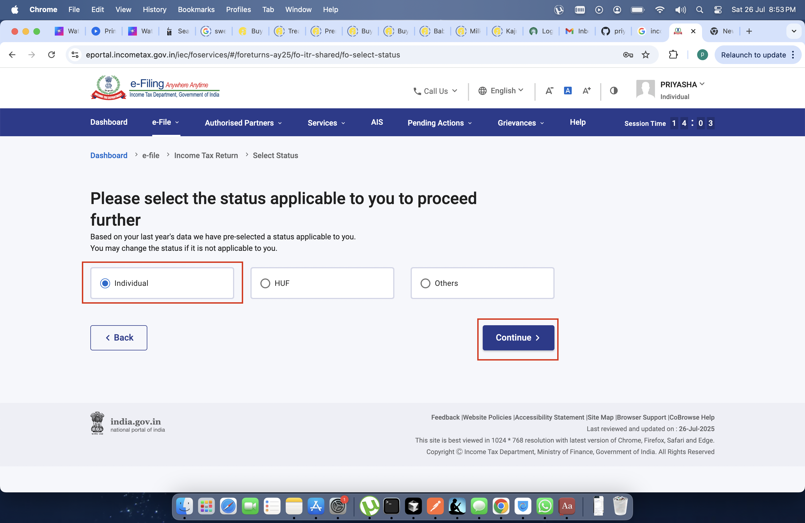
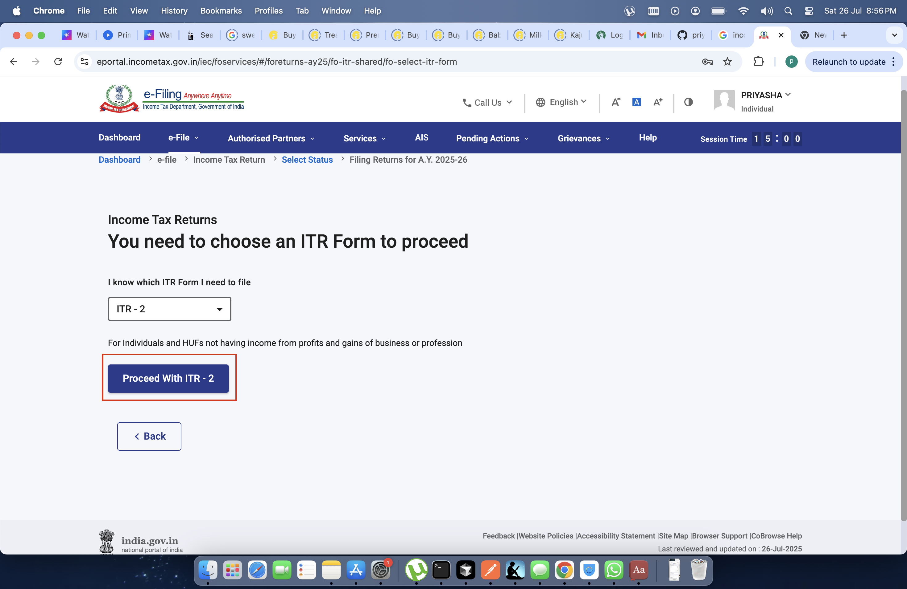
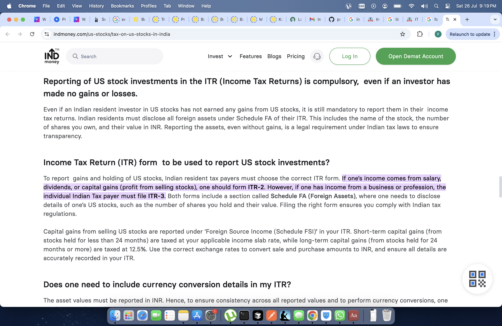
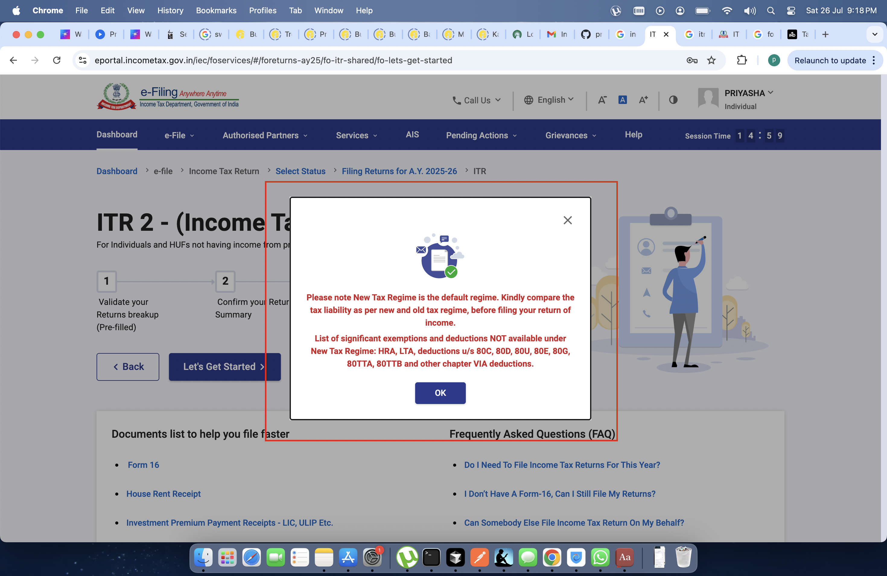

# How to File ITR for Foreign Assets

## Notes
- **ITR filing deadline** has been extended to **Sept 15th, 2025** (usually July).
- The tax portal is undergoing major changes, leading to the delay.
- [Income tax filing portal](https://eportal.incometax.gov.in/iec/foservices/#/login)

Login with your username (PAN) and password. If you don't remember your password, click on "Forgot your password" and reset via OTP on your registered mobile.

You will reach the [dashboard](https://eportal.incometax.gov.in/iec/foservices/#/dashboard):

1. Click on **e-File** on the top navigation bar.
2. Select **Income Tax Returns**.
3. Select **File Income Tax Returns**.

4. Select **Assessment Year** and **Mode of Filing**.
5. Click on **Continue**.

6. Select **Start New Filing**.

7. Select **Individual** as status.
8. Click on **Continue**.

9. Select **ITR 2** as your ITR form.
10. Select **Proceed with ITR 2**.

**Info: Why ITR-2?**
To report gains and holdings of US stocks, Indian resident taxpayers must choose the correct ITR form. If your income comes from salary, dividends, or capital gains (profit from selling stocks), you should use ITR-2.
[Reference: Tax on US Stocks in India](https://www.indmoney.com/us-stocks/tax-on-us-stocks-in-india)

11. You will receive a tax regime warning, select **Ok**.

> **Note:** The New Tax Regime is the default. Kindly compare the tax liability as per new and old tax regime before filing your return of income.

